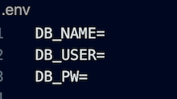

# E-Commerce-HW 

## Description

The purpose of this app is to be able to add, edit, and remove descriptors of retail items from a database. The descriptors include 'product,' 'category,' and 'tag.' The retail item descriptors work together; for example, a 'product' has a 'category' it belongs to, and the product can have multiple 'tags.' A real-life example would be a 'product' of a children's green ninja turtle t-shirt. The 'category' might be children's clothing. Two 'tags' might be green and t-shirt.

## Table of Contents

- [Installation](#installation)
- [Usage](#usage)
- [Assets](#assets)
- [License](#license)
- [GitHub Profile](#github-profile)
- [Contact by Email](#email)

## Installation

Run npm i to install necessary libraries.

## Usage

Create a .env file with the three lines shown below. Type the database name you want to use after the DB_NAME=, the location after DB_USER=, and your mysql password after DB_PW=.

\*Note: make sure the database name in the db directory on the schema.sql file matches the one you used on your .env file.

## Assets

[Demo Video]()

## License

This project is licensed with MIT.

### GitHub Profile

[My Profile](https://github.com/audrey-g37)

### Email

audrey.gillies@gmail.com
